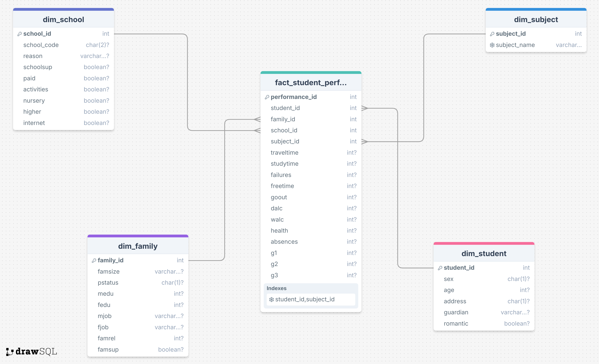

# Star Schema Warehouse
This repository contains a Star Schema version of the warehouse designed to analyze student performance across Math and Portuguese subjects. 

The warehouse is built around a central fact table, fact_student_performance, which stores measurable metrics. Surrounding it are denormalized dimension tables (dim_student, dim_family, dim_school, and dim_subject) that connect directly to the fact table through foreign keys. This structure minimizes join complexity and optimizes aggregation performance.

Unlike the Snowflake Schema version, which further normalizes dimension tables into sub-dimensions, the Star Schema keeps dimensions flattened. This reduces the number of joins required during queries, improves dashboard responsiveness, and simplifies business intelligence integration. Given the moderate size and analytical focus of the student datasets, the Star Schema is more optimal because it provides faster query performance, easier maintenance, and simpler BI tool compatibility without unnecessary structural complexity.

This implementation demonstrates efficient dimensional modeling, ETL processing, and dashboard-ready warehouse design tailored for educational analytics.