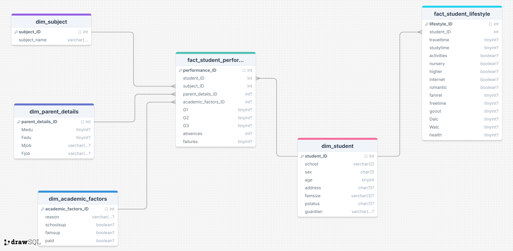

# Fact Constellation Schema
This branch will contain the constellation schema version...yet to find out what it's about but stay tuned!!
The constellation schema can be briefly described as two or more star schemas connected to each other (which explains the name) i.e. two or more fact tables in one schema.
