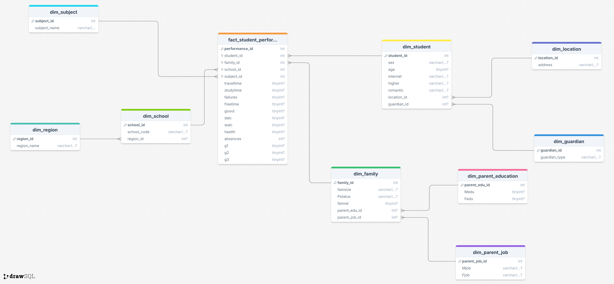

# Snowflake Data Warehouse Schema 
This branch contains the Snowflake version of the data warehouse designed to support multidimensional analysis of student performance data from the Math and Portuguese datasets. The project integrates both datasets into a structured analytical model using an ETL pipeline that extracts raw CSV data, transforms and normalizes dimension attributes, and loads the results into a MySQL warehouse.

The warehouse follows a snowflake design where the central fact table (fact_student_performance) stores measurable academic and behavioral metrics such as grades, absences, study time, and alcohol consumption levels. Dimension tables provide descriptive context and are further normalized into related sub-dimensions. For example, family attributes are separated into parent education and parent job dimensions, and school information may link to a region dimension. This reduces redundancy and enforces structured normalization.

A schema diagram illustrating the snowflake structure

The ETL pipeline is modularized into extractor, transformer, and loader components, ensuring repeatable and consistent data processing. The warehouse supports analytical queries, aggregation, and business intelligence integration through tools such as Metabase or a Flask-based dashboard.

This project demonstrates data warehouse modeling, schema normalization, ETL implementation, and dashboard integration for educational performance analytics. 